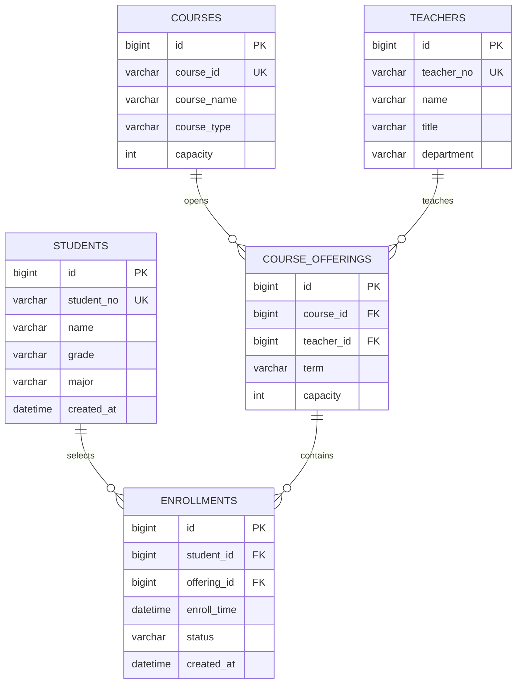

# 高校选课管理系统笔试任务交付说明

## 1. 使用的 AI 编程工具

- 工具名称：`ChatGPT（GPT-5 Codex）`

## 2. 提供给 AI 的完整提示词

```text
请基于 Spring Boot 3.x 实现一个高校选课管理系统练习项目，要求如下：
1) 复用第一题的选课记录实体，先做“去重+排序”：
   - 去重规则：studentId + courseId 相同视为重复，课程名称不同也算重复，保留首次出现。
   - 排序规则：先 studentId 升序，再 courseId 升序。
   - 输出格式：学生ID：XXX，课程ID：XXX，课程名称：XXX。
2) 在去重排序基础上升级后端能力：
   - 增加“选课分类”：按课程类型（公共课、专业课、选修课）分类存储；支持手动标注，也支持未标注时自动识别。
   - 增加“选课检索”：支持按学生ID、课程ID、课程名称、课程类型关键词检索；查不到返回“无匹配选课记录”。
   - 性能要求：1000条以上记录检索/排序响应 <= 1 秒；支持单次 >= 500 条批量导入。
3) 页面设计（简单即可）：
   - 一个页面，包含 CSV 文本框批量导入和数据展示。
   - CSV 每行格式：S000001,C000001,Java程序设计,专业课
   - 页面数据提交到后端，经过去重/排序/分类后回显。
   - 页面初始可展示后台样例数据。
4) 分层架构要求：
   - 严格 Controller -> Service -> Entity，不允许把业务逻辑放到 Controller。
   - 前端用 HTML + CSS + JavaScript（可配合 Thymeleaf），不引入复杂前端框架。
5) 额外产物：
   - 给出 SQL 题两条查询语句（课程选课人数统计、选课人数>50的专业课统计）。
   - 补充核心数据模型（含 teachers）与 ER 图。
   - 分析选课并发风险并给出一个可行方案。
   - 给出 enrollments 和 courses 的索引设计及理由。
```

## 3. 代码交付说明（AI 生成 vs 人工优化）

### 3.1 AI 生成主体（在现有项目结构中完成）

- `common` 模块：`EnrollRecord`、`EnrollmentProcessor`、示例运行与单元测试
- `sql` 模块：`schema.sql`、`queries.sql`、`task2readme.md`
- `web` 模块：`WebApplication`、`EnrollmentController`、`EnrollmentService`、`enrollment.html`、测试类

### 3.2 人工优化内容（本次补充与修正）

- 修复实体判等逻辑，保证 `equals/hashCode` 一致性（避免去重和集合行为风险）
- Service 层改为不可变快照存储，提升并发下读写安全性
- 增加页面初始化样例数据，满足“页面加载即展示数据”诉求
- 增加课程类型自动识别规则（未提供课程类型时按课程名识别）
- 支持 CSV 多分隔符输入（换行、英文分号、中文分号）
- SQL 查询列别名统一为 `course_id/course_name/enroll_count`，与题目字段口径一致
- 更新测试用例以覆盖自动分类和新的服务行为

## 4. SQL 题答案位置

- 文件：`sql/src/main/resources/sql/queries.sql`
- 题解文档：`sql/task2readme.md`

## 5. 核心数据架构设计（简化版）

### 5.1 核心实体与关系

- `students`（学生）
- `teachers`（教师）
- `courses`（课程）
- `course_offerings`（开课班次，某学期某教师授课）
- `enrollments`（学生选课记录）



说明：
- 如果按题目最简口径，也可只保留 `enrollments(student_id, course_id, enroll_time)` 与 `courses`。
- 实际系统建议引入 `course_offerings`，把“课程定义”和“学期开课实例”拆开，便于容量控制与并发扣减。

## 6. 选课高峰并发风险与方案

### 风险点

- 热门课程在短时间内大量并发选课，可能出现：
  - 超卖（容量被超额扣减）
  - 重复选课（同一学生重复请求）
  - 锁冲突导致响应抖动

### 简单可行方案（单库事务版）

1. 建唯一约束：`UNIQUE(student_id, offering_id)` 防重复。
2. 选课时在事务中执行：
   - `SELECT ... FOR UPDATE` 锁定 `course_offerings` 当前行；
   - 判断剩余名额 > 0；
   - `INSERT enrollments`；
   - `UPDATE course_offerings SET selected_count = selected_count + 1`。
3. 失败回滚并返回“名额已满”或“重复选课”。

优点：实现简单、强一致。  
适用：中小规模并发场景（笔试和教学系统 Demo 足够）。

## 7. 索引设计（enrollments / courses）

### 7.1 enrollments

- `PRIMARY KEY (student_id, course_id)`  
  理由：天然符合“同一学生同一课程不能重复选”。
- `INDEX idx_enrollments_course_id (course_id)`  
  理由：支持按课程统计选课人数（题目 SQL 高风险扫描列）。
- `INDEX idx_enrollments_enroll_time (enroll_time)`  
  理由：便于按时间窗口审计或统计峰值。

若使用 `offering_id` 模型：
- `UNIQUE KEY uk_student_offering (student_id, offering_id)`
- `INDEX idx_enrollments_offering_id (offering_id)`

### 7.2 courses

- `PRIMARY KEY (course_id)`
- `INDEX idx_courses_type (course_type)`  
  理由：支持“专业课”筛选。
- `INDEX idx_courses_name (course_name)`  
  理由：支持按课程名检索（前缀匹配场景）。

## 8. 运行说明

```bash
mvn test
mvn -pl web spring-boot:run
```

浏览器访问：

- `http://localhost:8080/enrollment`

