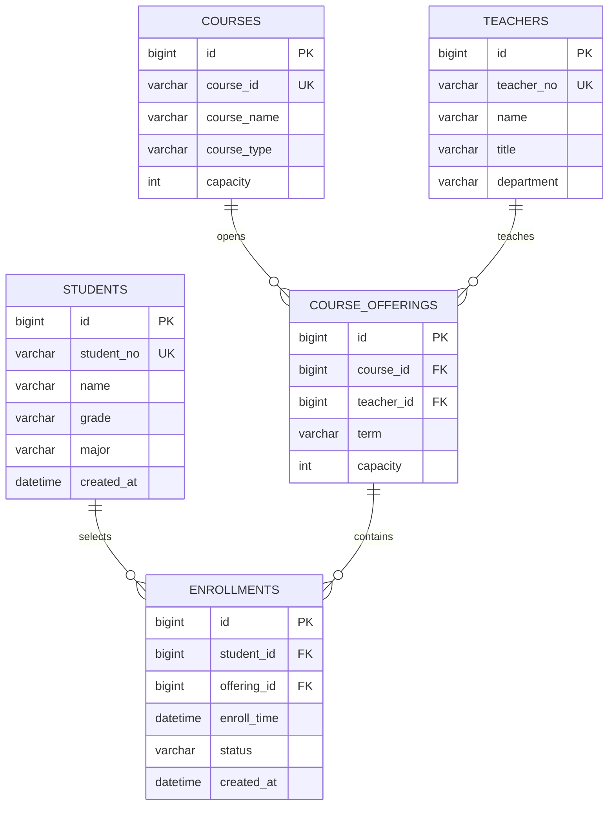

# 高校选课管理系统笔试提交稿

## 1. AI 工具与完整提示词

- AI 工具：`ChatGPT（GPT-5 Codex）`

```text
请基于 Spring Boot 3.x 实现一个高校选课管理系统练习项目，要求如下：
1) 复用第一题的选课记录实体，先做“去重+排序”：
   - 去重规则：studentId + courseId 相同视为重复，课程名称不同也算重复，保留首次出现。
   - 排序规则：先 studentId 升序，再 courseId 升序。
   - 输出格式：学生ID：XXX，课程ID：XXX，课程名称：XXX。
2) 在去重排序基础上升级后端能力：
   - 增加“选课分类”：按课程类型（公共课、专业课、选修课）分类存储；支持手动标注，也支持未标注时自动识别。
   - 增加“选课检索”：支持按学生ID、课程ID、课程名称、课程类型关键词检索；查不到返回“无匹配选课记录”。
   - 性能要求：1000条以上记录检索/排序响应 <= 1 秒；支持单次 >= 500 条批量导入。
3) 页面设计（简单即可）：
   - 一个页面，包含 CSV 文本框批量导入和数据展示。
   - CSV 每行格式：S000001,C000001,Java程序设计,专业课
   - 页面数据提交到后端，经过去重/排序/分类后回显。
   - 页面初始可展示后台样例数据。
4) 分层架构要求：
   - 严格 Controller -> Service -> Entity，不允许把业务逻辑放到 Controller。
   - 前端用 HTML + CSS + JavaScript（可配合 Thymeleaf），不引入复杂前端框架。
5) 额外产物：
   - 给出 SQL 题两条查询语句（课程选课人数统计、选课人数>50的专业课统计）。
   - 补充核心数据模型（含 teachers）与 ER 图。
   - 分析选课并发风险并给出一个可行方案。
   - 给出 enrollments 和 courses 的索引设计及理由。
```

## 2. 题目一（Java 去重/排序/打印）

- 实体类：`talkingdata-bishi-common/src/main/java/com/talkingdata/studentcourse/common/entity/EnrollRecord.java`
- 工具类：`talkingdata-bishi-common/src/main/java/com/talkingdata/studentcourse/common/util/EnrollmentProcessor.java`
- 演示入口：`talkingdata-bishi-common/src/main/java/com/talkingdata/studentcourse/common/EnrollmentProcessorDemo.java`

## 3. 题目二（SQL）

- 查询语句：`talkingdata-bishi-sql/src/main/resources/sql/queries.sql`
- 表结构与样例数据：`talkingdata-bishi-sql/src/main/resources/sql/schema.sql`

## 4. 题目三（Spring Boot 3.x 功能升级）

- Controller：`talkingdata-bishi-web/src/main/java/com/talkingdata/studentcourse/web/controller/EnrollmentController.java`
- Service：`talkingdata-bishi-web/src/main/java/com/talkingdata/studentcourse/web/service/EnrollmentService.java`
- 页面：`talkingdata-bishi-web/src/main/resources/templates/enrollment.html`
- 配置：`talkingdata-bishi-web/src/main/resources/application.yml`

实现点覆盖：

1. CSV 批量导入（支持换行、英文分号、中文分号分隔）
2. 去重规则：`studentId + courseId`
3. 排序规则：先 `studentId`，后 `courseId`
4. 分类能力：公共课/专业课/选修课（支持手动标注与自动识别）
5. 检索能力：学生ID、课程ID、课程名称、课程类型
6. 无匹配提示：`无匹配选课记录`
7. 运行态可观测：`/enrollment/ops/stats` 与 Actuator 端点

## 5. 分析与设计（ER 图、并发、索引）



- 并发风险：热门课并发时超卖、重复选课、锁冲突。
- 简单可行方案：事务 + `SELECT ... FOR UPDATE` + 唯一约束（`student_id, offering_id`）。
- 索引建议：
  - `enrollments`：`PRIMARY KEY(student_id, course_id)`、`INDEX(course_id)`、`INDEX(enroll_time)`
  - `courses`：`PRIMARY KEY(course_id)`、`INDEX(course_type)`、`INDEX(course_name)`

## 6. AI 生成与人工优化说明

- AI 生成部分：基础分层、CSV导入、检索、分类、SQL 和初始页面。
- 人工优化部分（本次二次开发）：
  - 修复模板表达式，保证分类标题稳定渲染。
  - 重构 Service：新增导入统计对象（总行/有效/无效/去重量）。
  - 新增运行态统计端点 `/enrollment/ops/stats`。
  - 引入 Actuator，暴露 `health/info/metrics`。
  - 增加脚本化验证入口与仓库入口文档，降低评审成本。

## 7. 运行与验证（使用指定 Maven）

指定 Maven：
`C:\Users\23655\Desktop\aiEngineer\mvn\apache-maven-3.9.12\bin\mvn.cmd`

```powershell
.\scripts\verify.ps1
.\scripts\run-web.ps1
```

手动命令：

```powershell
& "C:\Users\23655\Desktop\aiEngineer\mvn\apache-maven-3.9.12\bin\mvn.cmd" test
& "C:\Users\23655\Desktop\aiEngineer\mvn\apache-maven-3.9.12\bin\mvn.cmd" -pl talkingdata-bishi-web -am package
java -jar .\talkingdata-bishi-web\target\talkingdata-bishi-web-1.0.0.jar
```

页面地址：`http://localhost:8080/enrollment`
